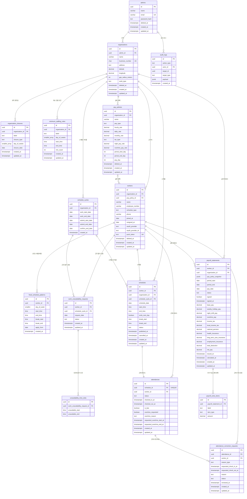

# ERD — 일감 (근무 플랫폼)

> 기준: `erd.sql` | 렌더링: GitHub Mermaid 자동 지원

```mermaid
erDiagram

    admins {
        uuid id PK
        varchar name
        varchar email UK
        text password_hash
        timestamptz deleted_at
        timestamptz created_at
        timestamptz updated_at
    }

    organizations {
        uuid id PK
        uuid admin_id FK
        varchar name
        char business_number UK
        text address
        decimal latitude
        decimal longitude
        int gps_radius_meters
        text work_type
        timestamptz deleted_at
        timestamptz created_at
        timestamptz updated_at
    }

    organization_closures {
        uuid id PK
        uuid organization_id FK
        text label
        text closure_type
        smallint_array day_of_weeks
        date closure_date
        timestamptz created_at
        timestamptz updated_at
    }

    minimum_staffing_rules {
        uuid id PK
        uuid organization_id FK
        text label
        smallint_array day_of_weeks
        time start_time
        time end_time
        int min_count
        timestamptz created_at
        timestamptz updated_at
    }

    pay_policies {
        uuid id PK
        uuid organization_id FK
        varchar name
        text pay_type
        decimal hourly_rate
        decimal daily_rate
        decimal monthly_rate
        text tax_type
        decimal night_pay_rate
        decimal overtime_pay_rate
        int period_start_day
        int period_end_day
        int pay_day
        timestamptz deleted_at
        timestamptz created_at
        timestamptz updated_at
    }

    workers {
        uuid id PK
        uuid organization_id FK
        uuid pay_policy_id FK
        varchar name
        varchar employee_number
        text schedule_type
        varchar phone
        date joined_at
        date resigned_at
        text oauth_provider
        text oauth_provider_id
        text push_token UK
        timestamptz deleted_at
        timestamptz created_at
        timestamptz updated_at
    }

    fixed_schedule_patterns {
        uuid id PK
        uuid worker_id FK
        smallint day_of_week
        time start_time
        time end_time
        time break_start
        time break_end
        date apply_from
        timestamptz created_at
    }

    schedule_cycles {
        uuid id PK
        uuid organization_id FK
        date work_start_date
        date work_end_date
        date submit_start_date
        date submit_end_date
        date confirm_end_date
        timestamptz created_at
    }

    schedules {
        uuid id PK
        uuid worker_id FK
        uuid organization_id FK
        uuid schedule_cycle_id FK
        date schedule_date
        time start_time
        time end_time
        boolean ends_next_day
        time break_start
        time break_end
        text status
        timestamptz published_at
        timestamptz cancelled_at
        timestamptz created_at
        timestamptz updated_at
    }

    work_unavailability_requests {
        uuid id PK
        uuid worker_id FK
        uuid schedule_cycle_id FK
        date request_date
        text status
        timestamptz created_at
        timestamptz updated_at
    }

    unavailability_time_slots {
        uuid id PK
        uuid work_unavailability_request_id FK
        time unavailable_start
        time unavailable_end
    }

    attendances {
        uuid id PK
        uuid schedule_id FK "UNIQUE"
        uuid worker_id FK
        text status
        timestamptz checked_in_at
        timestamptz checked_out_at
        boolean is_late
        boolean overtime_requested
        text overtime_reason
        timestamptz requested_overtime_start_at
        timestamptz requested_overtime_end_at
        timestamptz created_at
        timestamptz updated_at
    }

    attendance_correction_requests {
        uuid id PK
        uuid attendance_id FK
        uuid worker_id FK
        text reason_type
        timestamptz requested_check_in_at
        timestamptz requested_check_out_at
        text reason
        text status
        timestamptz reviewed_at
        timestamptz created_at
        timestamptz updated_at
    }

    payroll_statements {
        uuid id PK
        uuid worker_id FK
        uuid organization_id FK
        jsonb pay_policy_snapshot
        date period_start
        date period_end
        date pay_date
        text status
        boolean signed
        timestamptz signed_at
        decimal base_pay
        decimal weekly_holiday_pay
        decimal night_shift_pay
        decimal overtime_pay
        decimal income_tax
        decimal local_income_tax
        decimal national_pension
        decimal health_insurance
        decimal long_term_care_insurance
        decimal employment_insurance
        decimal total_deduction
        decimal net_pay
        timestamptz issued_at
        timestamptz calculated_at
        timestamptz created_at
        timestamptz updated_at
    }

    payroll_extra_items {
        uuid id PK
        uuid payroll_statement_id FK
        text label
        text item_type
        decimal amount
    }

    audit_logs {
        uuid id PK
        text action_type
        uuid actor_id FK
        uuid target_id
        text target_type
        jsonb payload
        timestamptz created_at
    }

    admins ||--o{ organizations : "조직"
    admins |o--o{ audit_logs : "감사 로그"

    organizations ||--o{ organization_closures : "조직 휴무일"
    organizations ||--o{ minimum_staffing_rules : "최소 인원 조건"
    organizations ||--o{ pay_policies : "급여 정책"
    organizations ||--o{ workers : "근무자"
    organizations ||--o{ schedule_cycles : "스케줄 사이클"
    organizations ||--o{ schedules : "스케줄"
    organizations ||--o{ payroll_statements : "급여 명세서"

    pay_policies |o--o{ workers : "급여 정책"

    workers ||--o{ fixed_schedule_patterns : "고정 스케줄 패턴"
    workers ||--o{ schedules : "스케줄"
    workers ||--o{ work_unavailability_requests : "근무 불가 신청"
    workers ||--o{ attendances : "근태 레코드"
    workers ||--o{ attendance_correction_requests : "근태 수정 요청"
    workers ||--o{ payroll_statements : "급여 명세서"

    schedule_cycles ||--o{ work_unavailability_requests : "근무 불가 신청"
    schedule_cycles |o--o{ schedules : "스케줄 사이클"

    schedules ||--|| attendances : "근태 레코드"

    work_unavailability_requests ||--o{ unavailability_time_slots : "시간대 불가 조건"

    attendances ||--o{ attendance_correction_requests : "근태 수정 요청"

    payroll_statements ||--o{ payroll_extra_items : "추가 지급·공제 항목"
```
